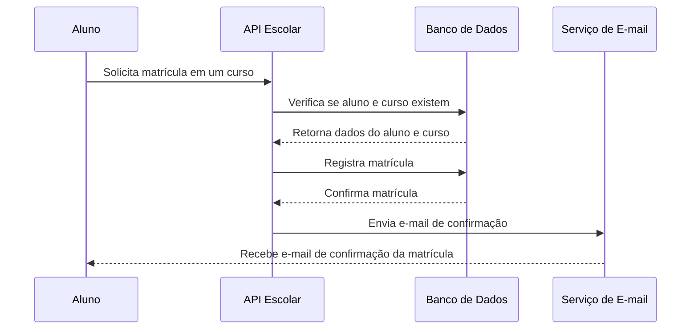

# Sistema de Gerenciamento Escolar

Repositório com o desafio a ser resolvido pelos candidatos à vaga de **backend**.  

> Um sistema de gerenciamento escolar permite que cursos, disciplinas e alunos sejam cadastrados e relacionados, possibilitando a recuperação dos dados de forma organizada.  

Você precisa desenvolver uma **API RESTful** para gerenciar cursos, disciplinas e alunos de uma escola.  

**Apenas implemente a camada de regras de negócio e a API.** Não é necessário frontend.  

---

## Regras de Negócio

### Curso
Cada curso deve ter:
- Nome  
- Descrição  
- Carga horária  
- Data de cadastro  

### Disciplina
Uma disciplina pode pertencer a 2 ou mais cursos, por exemplo "Introdução a Administração" pode ser do curso de "Direito", mas também pode estar no curso de "Sistemas de Informações".

Uma disciplina contem:  
- Nome da disciplina  
- Descrição  
- Carga horária  
- Curso(s)  

### Aluno
Cada aluno deve ter:  
- Nome  
- CPF  
- Data de nascimento  
- Curso(s) no qual está matriculado  

### Matrícula
- A matrícula deve vincular um aluno a um curso  
- Ao realizar a matrícula, o sistema deve disparar uma **confirmação por e-mail** ao aluno com os dados da matrícula  

---

## Funcionalidades da API

A API deve permitir:  

### Cursos
- Listar cursos
- Cadastrar curso  
- Editar curso  
- Excluir curso (apenas se o curso não tiver ninguem matriculado)  

### Disciplinas
- Listar todas as disciplinas
- Listar disciplinas por curso  
- Cadastrar disciplina em um curso  
- Editar disciplina  
- Excluir disciplina

### Alunos
- Listar alunos
- Listar alunos matriculados em um curso
- Cadastrar aluno vinculando a pelo menos um curso
- Vincular aluno a outro(s) curso(s)  
- Editar aluno  
- Excluir aluno 
- Buscar aluno por CPF e retornar seus dados pessoais + curso(s) matriculado(s)  

### Matrículas
- Realizar matrícula de um aluno em um curso
- Trancar matricula de um aluno em um curso
- Disparar **e-mail de confirmação** da matrícula  
- Listar matrículas existentes  

---

## Fluxo da Matrícula
Abaixo um fluxograma para ajustar a ilustrar a regra de negócio:

## Requisitos

- Deve ser desenvolvido utilizando PHP OO (com ou sem frameworks), design patterns e princípios SOLID, se optar por frameworks sugerimos Laravel ou Symfony.
- A Arquitetura e o System Design da aplicação será um diferencial, decida, documente e argumente
- Testes automatizados devem ser implementados (PHPUnit ou semelhante)
- O projeto deve estar preparado para inclusão de novas entidades (como professores, turmas, etc.)
- Dockerizar para facilitar a execução

### Diferenciais

- Documentação da API (Swagger ou similar)
- Envio de e-mails (Mailpit, Mailhog ou outro SMTP fake para testes)
- Scripts de seeders/fixtures para popular a aplicação com dados iniciais

## Entrega

- Crie um repositório público com a sua solução
- Envie o link para o e-mail informado no convite do desafio
- O prazo de entrega está definido no e-mail

Bom trabalho e boa sorte!

